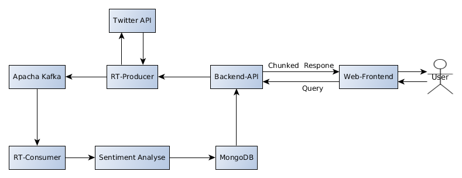

# **Architektur**

# Komponenten
Jede Komponente ist ein eigenständiges Programm und kommuniziert mit den anderen Komponenten ausschließlich festgelegte Schnittstellen. Von jeder Komponente können jederzeit mehrere Instanzen gleichzeizig laufen um Lastverteilung, Ausfallsicherheit und unterbrechungsfreie Updates zu ermöglichen. (Microservice)

Übergangsweise wird ersteinmal davon ausgegangen, dass von jeder Komponente nur eine Instanz existiert. Außerdem können mehrere Komponenten (z.B. Producer und Webapp) in einem einzelnen Programm zusammengefasst werden. (Monolith)

## **Producer**

Der Producer ist eine Java-Anwendung.

Der Producer ruft basierend auf von den Endnutzern vorgegebenen Filterkriterien (Hashtags,Userhandles,Geolocation) Tweets von der Twitter-API ab und speichert sie in den Kafka. Es existiert nur ein Kafka-Topic für Rohtweets, in dem alle geladenen Tweets liegen. 

Die Anfrage eines Nutzers nach Tweets die einem bestimmten Filter entsprechen wird im folgenden Abo genannt.
Ein Producer kann mit einem Thread parallel mehrere Abos bearbeiten, sofern diese die gleichen Filter anfordern. Existiert zu einem von einem Nutzer angeforderten Abo bereits ein Producer-Thread (Nutzer a analysiert bereits #tatort und Nutzer b will das nun auch tun) wird kein neuer Thread gestartet, sondern der bereits bestehende weiter verwendet.

**Da mehrere Producer-Instanzen parallel arbeiten sollen müssen einige Dinge beachtet werden:**
Jedes Abo muss GENAU EINER Instanz zugeordnet werden  
Fällt eine Instanz aus müssen die anderen Instanzen deren Abos übernehmen  
Existiert ein Abo bereits in einer Instanz darf keine weitere Instanz ein identisches Abo bearbeiten, da sonst die tweets mehrfach in ihrem Kafka-Topic vorliegen. (möchte ein neuer Nutzer die selben tweets beobachten soll er das bestehende Abo mit nutzen)  
Wenn sich kein aktiver Nutzer mehr für einen bestimmtes Abo interessiert soll das Abo (also der Producer-Thread) (nach einer gewissen Zeit) entfernt werden. Gerade wenn mehrere Nutzer ein Abo teilen muss sichergestellt werden, dass der Thread erst beendet wird, wenn DER LETZTE NUTZER der Abos sich nicht mehr dafür Interessiert.  

### **Überganslösung Producerverwaltung**
Da die Organisation von mehreren unabhängigen Producer-Instanzen mit einigem Aufwand verbunden ist, wird vorerst mit einem einzelnen Producer gearbeitet. Dadurch reduziert sich der Verwaltungsaufwand erheblich. Außerdem wird der Producer in den Webserver integriert, wodurch die Kommunikation zwischen Producer und Webapp bequem mittels Java passieren kann (kein IPC, Kafka, Zookeeper o.ä. nötig).

## **Twitter-API** 
Die Realtime-Streaming-API von Twitter liefert nur neu erstellte Tweets. Ein Nutzer der einen bestimmten Hashtag analysiert müsste also warten, bis neue Tweets zu diesem Hashtag erstellt werden. Allerdings bietet Twitter eine weitere API um (bis zu 7 Tage) alte Tweets abzurufen. Beide APIs werden kombiniert benutzt um sowohl bestehende als auch neue Tweets zu erhalten.
~~Wird ein Producer-Thread gestartet muss dieser prüfen ob und bis zu welchem Zeitpunkt bereits Tweets zu diesem Filterkriterium in Kafka vorhanden sind und nachfolgend nur neuere historische Tweets von der Twitter-API laden.~~ Es ist egal ob bestimmte tweets doppelt in den Kafka gelangen, da beim Einfügen in die MongoDB sichergestellt wird, dass jeder Tweet nur einmal in der Datenbank enthalten ist. Beim Starten ruft der Producer die historischen Tweets ab und startet danach mit dem Streaming neuer Tweets zu seinem Hashtag.

## **Apacha Kafka** 

### **Topic-Struktur**

Der Apacha Kafka enthält nur ein Topic: "tweets"

## **Analyzer**
Der Analyzer liest die Tweets die der Producer in den Kafka geschrieben hat und führt eine Sentiment-Analyse darauf aus.
Der Tweet (erweitert um das Ergebnis der Analyse) wird anschließend in die MongoDB gespeichert. 

Sollte sich herausstellen das die Sentiment-Analyse ein Performance-Engpass ist, da Tweets stellenweise mehrfach analysiert werden (z.B. da sie mehrere Hashtags enthalten und somit mehreren verschiedenen Filterkriterien entsprechen) könnte man überlegen vor der Analyse in der Datenbank zu prüfen ob dieser Tweet bereits einmal analysiert wurde.

## **MongoDB**
Analysierte tweets werden in einer MongoDB gespeichert. Standardmäßig befinden sich die analysierten Tweets in der Datenbank "twitter" und der collection "tweets". Der Analyzer stellt sicher, dass diverse Indexe auf den für Analysen relevanten Feldern der Tweets existieren (zurzeit unique index für id, index für hashtags und zeiträume). Weitere indexe können hinzugefügt werden, sobald die Webapp Suchanfragen auf diesen Attributen ermöglicht.  
Das Webapp-Backend ließt existierende Tweets zu eingehenden Suchanfragen mittels eines "normalen" queries. Neue (nach beginn des API-Requests eingehende) Tweets (die den Filterkriterien des Queries entsprechen) werden mittels MongoDB change streams in Echtzeit von der Datenbank and die webapp übermittelt. Um change streams nutzen zu können muss die MongoDB als replica-set laufen, wobei allerdings für Entwicklungs- und Testzwecke auch eine einzelne Instanz ausreicht.

## **Webapp**
Die Webapp besteht aus zwei Komponenten, Backend und Frontend.
Das Backend liest die fertig analysierten Tweets aus MongoDB (die zu dem jeweiligen Nutzer gehören) und übermittelt sie an das Frontend, welches sie dem Nutzer anzeigt. Außerdem ermöglicht das Frontend dem Nutzer anzugeben welche Tweets er analysieren möchte. Diese Analyseanfrage wird an das Backend übermittelt, welches diese Anfrage letztendlich an die Producer übermittelt.

### **Frontend**
Das Frontend bietet dem Nutzer die Möglichkeit Queries an das Backend zu schicken und zeigt die Ergebnisse der Querries auf mehrere Arten an:  
- Lister der n aktuellsten Tweets samt Analyseergebnis
- Positivste / Negativste Tweets der letzten X Minuten
- Graph der zeitlichen entwicklung der durchschnittlichen (oder summierten) Stimmung

### **Backend**
Das Backend stellt APIs zur Verfügung die jeweils ein Query entgegennehmen und Ergebnisse zurückgeben.

Wenn ein eingehender API-Aufruf erfordert, dass ein neuer Producer gestartet wird (da zu dem angefragten Query noch kein PRoducer aktiv ist), so sorgt das Backend dafür das ein entsprechender Producer gestartet wird.

Der einzige bisher vorgesehene API-Endpunkt ist /api/TweetStream. Andere Endpunkte (z.B. um Analyseergebnisse anbzufragen) sind derzeit nicht nötig, da sämtliche Analysen im Frontend erfolgen.

# Implementierungsdetails

## **Kommuniktation Frontend-Backend**
Das Frontend soll in Echtzeit aktualisiert werden. Dafür müssen Daten vom Backend gestreamt werden.
Dafür werden  HTTP/1.1 chunked responses verwendet.

## **Lebenszeit von Producer-Threads**
Jeder Producer-Thread liefet Daten für einen oder mehrere aktive Nutzer. Sobald es 5 Minuten lang keinen aktiven Nutzer zu einem Producer-Thread mehr gibt wird dieser beendet.

## **Zuordnung von Queries zu Nutzern**
Nutzer werden nicht "wirklich" getrackt. Ein user existiert für die API nur für die Dauer eines API-Zugriffs (welche im Falle von Stream-APIs aber durchaus längere Zeit dauern können). Queries sind dem API-Request zugeordnet mit dem sie ausgeführt werden. Wird der Request beendet wird der "Nutzer" aus den aktiven Nutzern des Queries entfernt.

## **Zuordnung von Abos zu Producern**
ZURZEIT NOCH NICHT RELEVANT.  
Siehe Producer/Übergangslösung
Nutzeranfragen nach Tweets müssen EXAKT EINEM Producer zugeordnet werden. Ich denke das dafür ein System für verteiltes Locking zwingend nötig ist. Da Kafka sowieso einen Zookeeper benötigt würde es sich anbieten Zookeeper dafür zu nutzen.
Ablauf:
Alle Producer watchen ein Verzeichnis (z.b. /abos) in Zookeper auf veränderungen
Nutzer erstellt neues Abo
Webapp-Backend erstellt einen Eintrag in /abos für das abo (existiert der eintrag bereits wird ein Zähler in dem Eintrag erhöht)
Die Producer-Instanzen bemerken den neuen Eintrag und konkurrieren um ein Lock für den Eintrag. Die Instanz die das Lock erhält erzeugt einen Thread für das Abo

Das beschriebene Verfahren bringt verschiedene Vorteile:
Abos werden nicht mehrfach an Producer vegeben
Fällt eine Producer-Instanz aus verfallen ihre Locks und andere Instanzen übernehmen diese automatisch (so funktieren zookeper-locks, da müssen wir nichts implementieren)
Meldet sich ein User ab, löscht dessen Webapp-Instanz seinen Eintrag in /abos (beziehungsweise dekrementiert den Counter und löscht wenn dieser 0 erreicht) woraufhin der Producer-Thread beendet wird. Abos die keinen Mehr interessieren werden gelöscht.
Fällt eine Webapp-Instanz aus verschwinden automatisch alle von ihr angelegten Einträge in /abos. Es bleiben also keine Thread-Leichen zurück.

## **Clusterverwaltung**
Es handelt sich hier um ein Verteiltes System. Ein solches manuell zu aufzubauen und zu verwalten ist aufwändig und nervig.
Daher soll hierfür Docker verwendet werden.
Dabei beschreibt man in einer Datei welche Komponenten man mit welchen Optionen und wie vielen Replikaten man haben möchte und docker startet/beendet/updated dann auf Kommando das komplette System. Das funktioniert sogar verteilt über mehrere Server.
Außerdem ist ein solcher Cluster portabel und jeder der Docker installiert hat kann mit einem einzelnen Kommando ein komplettes Cluster starten.

